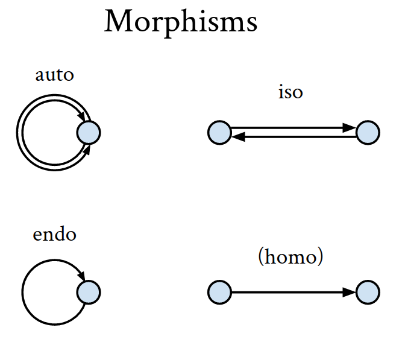

# Haskell Tweets

These are my quick notes in the path of learning Haskell.

---

The `Ordering` type is a `Monoid` in the "lexical graphical ordering" sense.

---

A Type Class in Haskell has to be defined for a specific *kind*. `Real` is defined for `*`, but
`Monad` is defined for `* -> *`.

---

The class definition

    class (Eq a) => Ord a

can be read as "`a` can be an `Ord` only *when* it satisfies `Eq a`".

---

Tail recursion in Haskell:

    func x y = func (x-1) (.. something with x and y ..)

in which case the `something with x and y` part can be
calculated eagerly so that no stack memory space is needed.
The classic example is the `foldl`:

    foldl :: (a -> b -> b) -> b -> [a] -> b
    foldl f z []     = z
    foldl f z (x:xs) = foldl f (f x z) xs

If let evaluated lazily, the memory builds up:

    foldl f z (x1:xs) = foldl f (f x1 z) xs
                      = foldl f (f x2 (f x1 z)) xs
                      = foldl f (f x3 (f x2 (f x1 z))) xs
                      = ...

So a simple remedy would be to let the second argument evaluated
eagerly:

    foldl f...

---

Monad IO is a functor:

    (>>=) :: m a -> (a -> m b) -> m b

    (>>=) :: IO a -> (a -> IO b) -> IO b

`IO Int` is another category where a "functorial" mapping for `Int` is defined (via `fmap`).
However, it has a *higher-level* structure than a functor does -- it is also an `Applicative`,
and in fact, an `Monad`.

---

An endo-`Functor` has the following `fmap` signature:

    fmap :: (a -> b) -> f a -> f b

A recursive `Functor` looks like this:

    data Mu (f :: * -> *) = In (f (Mu f))

    newtype Mu f = In { in :: f (Mu f) 

---

> *[L]aziness* and *side effects* are, from a practical point of view, incompatible.

-- SPJ 2010 (Tackling)

---

You need a `class` when you need to define a function that is only "half generic", meaning that
these function use type variables (`a`, `b`, etc.) but not all possible `a` is acceptable.

When the constrain of your function agrees perfectly with another class, consider using "context"
instead:

    myFunc :: OtherClass a => a -> Int

is good enough.

---

The most important thing about the `State` monad is the fact that the "state" is ultimately sent
in by the "outside". (Doesn't it remind you of `IO`?)

---

`IO` is pretty much `State`, except that it only creates the illusion that the "realworld" is conatined
in a state object, whereas in reality the `get` and `set` methods are carefully mapped to system calls.

Things in this illusionized realworld object include:

  * System time
      - the global random number generator is derived from it
  * Files (in linux all following are just special cases of files)
      - Stdin (RO), Stdout (WO), Stderr (WO)
      - Environment Variables
      - Devices
  * Arguments

---

If we could ignore the isomorphisms, `IO a` is just `RW -> (RW, a)`.

So:

    return :: a -> IO a
           :: a -> RW -> (RW, a)

becomes almost a curried identity function. In fact,

    return = curry id

up to isomorphism.

---

A type `MuhType` is said to be a instance of `Monoid` when a `<>` is defined
on this type that satisfies:

  * There is a element `e :: MuhType` that `a <> e == e <> a == a` for all `a :: MuhType`
  * For all `a, b, c :: MuhType`, `(a <> b) <> c == a <> (b <> c)`

Now, when you think of `<>` as a morphism, the associativity and the identity element
are just two requirements asked by categories.

Reformulating the Haskell's definition of `Monoid` into a category:

  * The only object: `*`
  * Morphisms: `a`, `b`, `c`, etc.
  * Identity morphism: `e`

So any Haskell expression for a `Monoid` translates to a **morphism** in this single-valued
category.

Translation examples:

    e      => * --e--> *
    a      => * --a--> *
    a <> b => * --a--> * --b--> *
           => * --a <> b--> *
    a <> e => * --a--> * --e--> *
           => * --a--> *

---

---

The morphisms in a general category do **not** actually form a monoid. This is because
not all morphisms can be composed. For example, its undefined to compose

    (a -> b) <> (c -> d)

which also implies that there are more than one identity candidates (id morphisms for all individual objects).

---

# In what sense are monads monoid?

"A monad is a monoid for endofunctors."

Functors map two things: objects and morphisms.

...TBC...

---

RankNTypes permits higher-rank types.

[This SO answer explained it very well.](http://stackoverflow.com/a/12031900/667027)

To add to it, the syntax can be intepreted as that

    (forall a. a -> b) -> c

only accepts a function with type `forall a. a -> String`, or `forall a. a -> Int`, etc. That is, it does **not** accept
a function with type `Int -> String`. This is not possible to specify without RankNTypes.

This also explains why `(forall a. a) -> ()` is rank-2 but `(forall a. a)` is rank-1.

    u :: (forall a. a) -> ()
    u x = const () (x :: Int, x :: String)
